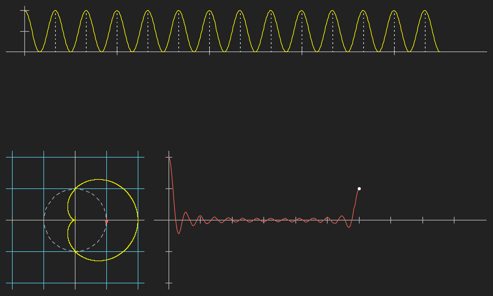

# 자연계 신호에 대한 해석툴인 퓨리에 변환에 대한 시각화

일단 퓨리에 변환에 대한 중요성은 익히 알고 있지만, 그 해석이 아직도 익숙하지가 않다. MP3, JPEG 압축 기술에 쓰이며, 시각, 청각 신호에 중 중요 성분(첫 몇항)만 뽑아서 저장해도 충분히 이질감 없이 원본 정보를 보고 들을 수 있음에 착안한 압축 방법이며, 그 때 사용하는 수학 도구이다.

유튜브를 보다가 다음 영상을 보고 똑같이 그려 보는 것을 목표로 만들었다.

https://www.youtube.com/watch?v=spUNpyF58BY

p5.js 를 이용하여 그렸으며 다음 영상을 참고 했다.

https://www.youtube.com/watch?v=MY4luNgGfms

결과물: https://redpeanut.github.io/hello-fourier/fourier2.html

<!--  -->

# 참고

